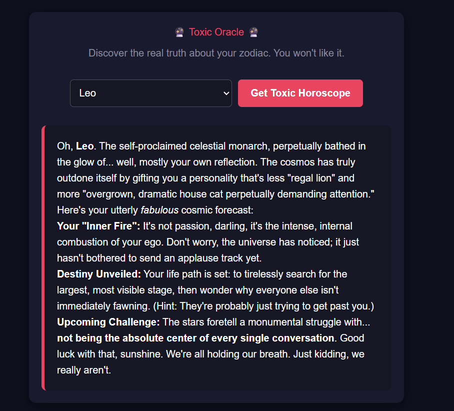

[FIRST ITERATION OF THE APPLICATION - More development to come.]

This needs to be tested only locally as it is not hosted on anything, hence it is mentioned it is the first iteration of this app.

# installation
Tech stack used for running: npm, React, tailwindcss, googleAPI.
1. for linux
opnening the Terminal, write the command ```sudo apt install nodejs```
2. for windows install from the website
Check installation with commands ```node --v``` & ```npm --v```

```cd frontend```

```npm install``` -> this installs the packages included in package.json
For your personal google API:
The google API key is created from https://aistudio.google.com/ -> click "Create API key", give a name to your project, copy the new key and insert into your .env file.
VITE_GEMINI_API_KEY=insert_copied_google_api_key

# Running on local machine

Finally test the app with the comand ```npm run dev```, copy the url from terminal into your browser and enjoy google's output.

For demo, watch the "demo.mp4".

Homepage looks like this:


After selectin from dropdown and clicking on the button:


