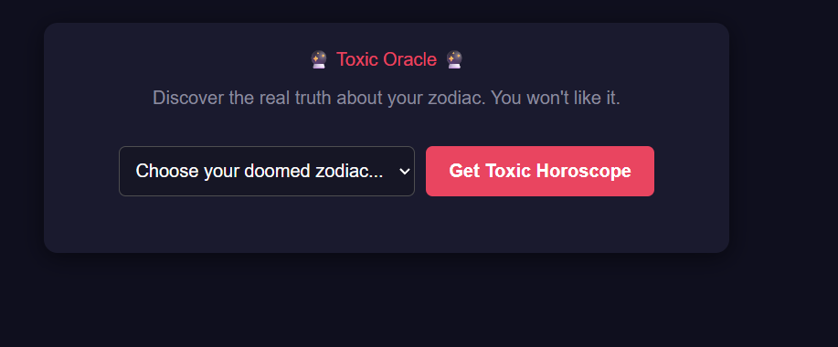
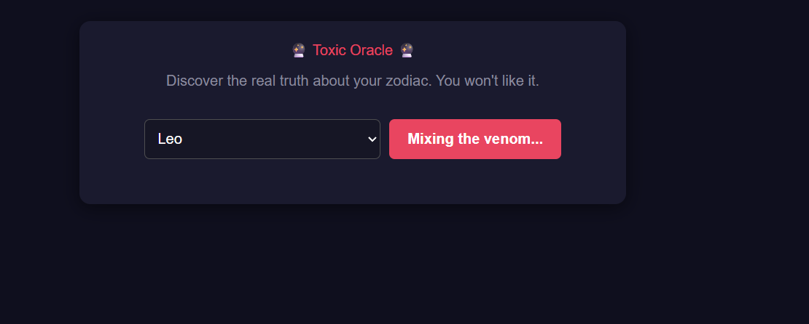
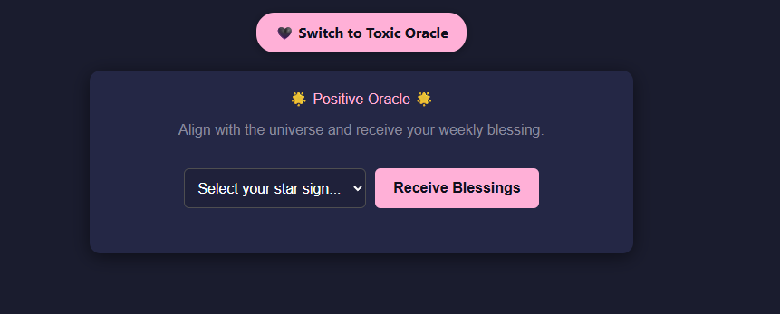
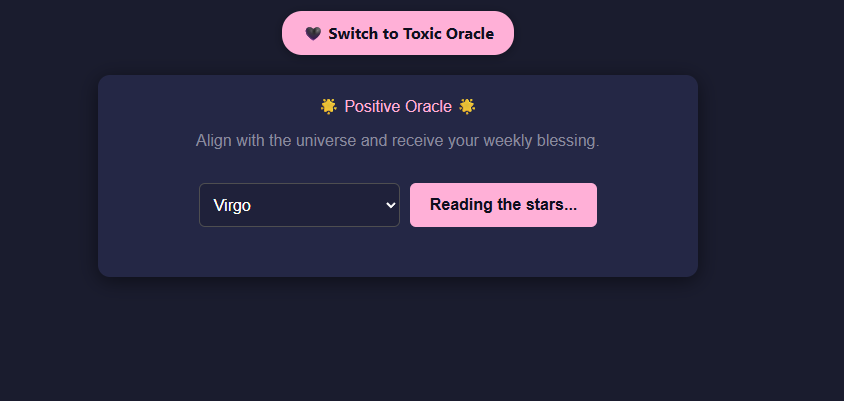
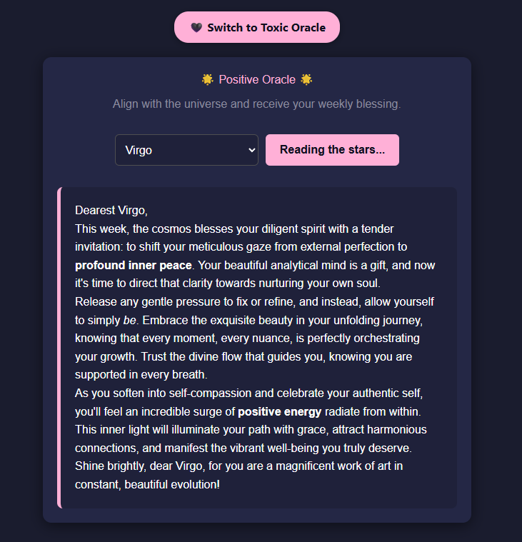

# Oracle with Google API

## Installation
Tech stack used for running: npm, React, tailwindcss, googleAPI.
1. for linux
opnening the Terminal, write the command ```sudo apt install nodejs```
2. for windows install from the official website

Check installation with commands ```node -v``` & ```npm -v```

```cd frontend```

```npm install``` -> this installs the packages included in package.json
For your personal google API:
The google API key is created from https://aistudio.google.com/ -> click "Create API key", give a name to your project, copy the new key and insert into your .env file.
VITE_GEMINI_API_KEY=insert_copied_google_api_key

## Running on local machine

Finally test the app with the comand ```npm run dev```, copy the url from terminal into your browser and enjoy google's output. 

Note: make sure you do cd frontend to run the above command, else npm doesn't find the App.jsx which contains the application.

Screenshots - default mode is toxic oracle - for switch press the Button "Switch to Positive Oracle":
### Toxic oracle





### Positive oracle





Note, when you clone on local machine this repo you can adjust the prompt for geminiAPI in the lines 23-24 in the App.jsx file. Enjoy!